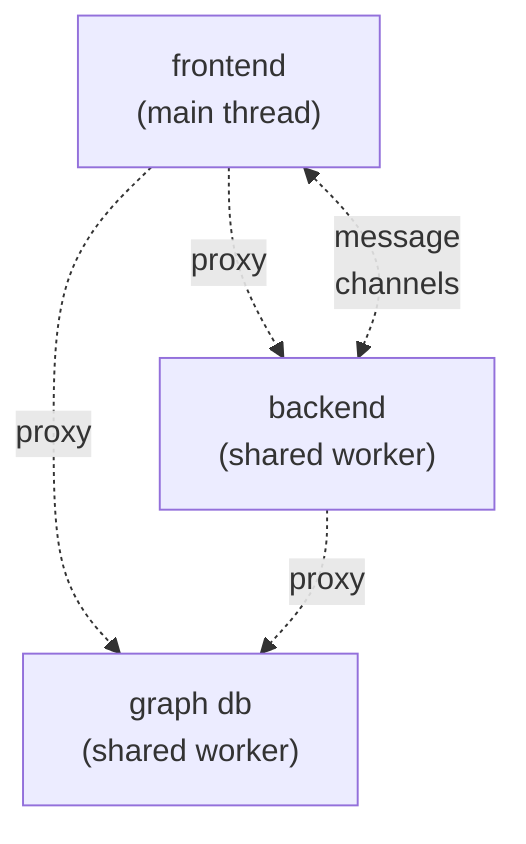
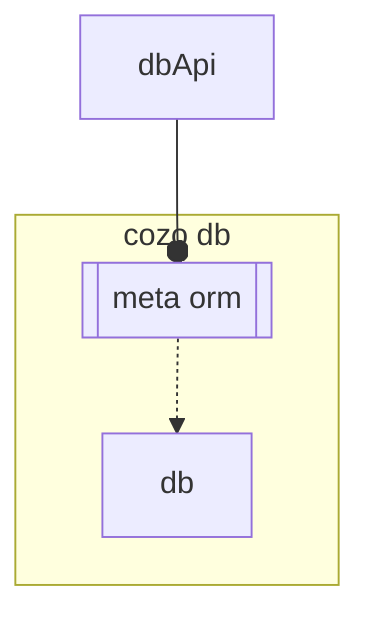
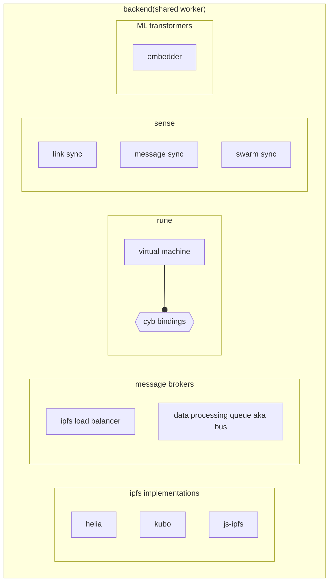
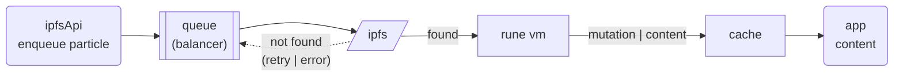
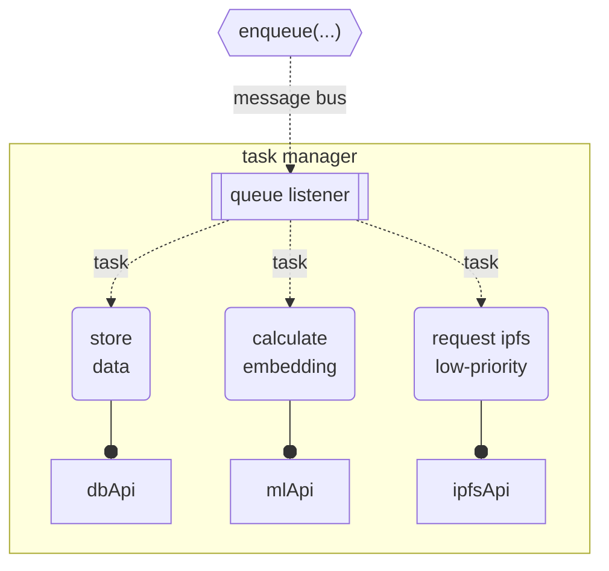
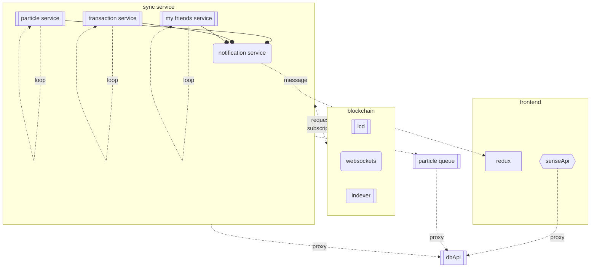
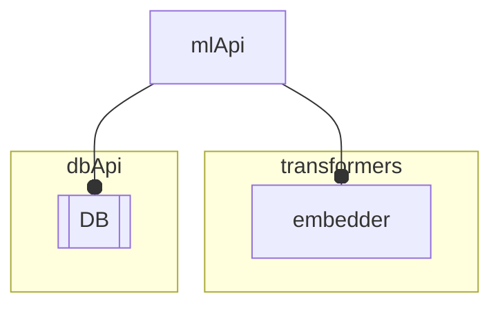

# CYB local backend(in-browser)

Cyb plays singinficat role in cyber infrastructure. The app reconstruct self-sufficient backend+frontend pattern inside the browser.
In big view app consist from 3 parts:

To reduce overload of main thread we have created 2 separate shared workers, where all the stuff is hosted. Bi-interraction between all layers occurs using proxy(comlink abstraction) or directly using broadcast channels.

## Db layer

Db worker is pretty simple it it's host only local relational-graph-vector database - [[cozo]]. It's represented with DbApi in frontend and backend layers.
Cozo provide bazing fast access to brain and ipfs data in relational form and also in vector format, processing by [ml]embedder.

### Db entities

- brain:
  - particles
    - embeddings
  - links
  - transactions
  - community
- sense:

  - sync items + update status

- system:
  - config
  - queue messages

## Backend layer

Backend worker is more complicated it contains significant elements of cyb architecture:

### Ipfs module

Represented with IpfsApi at frontend layer, but also have direct access for some edge cases

- Uses module that encapsulate different Ipfs implementations(kubo, helia, js-ipfs(obsolete))
  - cache content(local storage & cozo)
  - preserve redundancy
- Ipfs queue, process all requests to ipfs, prioritize, cancel non-actual requests and organize content pipeline
  - responsible for:
    - ipfs load balancing(limit of requests)
    - request prioritizing(actual requests first)
    - fault processing(switch fetch policy)
    - post processing(**inline rune vm** into pipeline)

## Bus

Represented with some helpers and used for cases when blaancer is needed, some services not initialized yet(deffered actions), or long calculations is requered(ml inference, ipfs requests):

- particle, request ipfs, save; calc embedding
- link, deffered save
- message persistence is protected by db store

## Sense

Represented by SenseApi + subscription to broadcast channel at fronted layer. Provide continious update of cyberlinks related to my brain and my swarm, recieving on chain messages etc.:

- Particles service (pooling)
- Transactions service (pooling + websocket)
- My friends service (pooling)
- Ipfs service(pooling)

All data and update status is stored into db, when some new data is recieved that triggers notification for frontendю

## Rune

Rune VM execution is pipelined thru special abstraction called entrypoints. VM have bindings to all app parts: DB, transformers, signer, blockchain api, ipfs and also includes context of the entrypoint.(see. [[scripting]] for detailed description).

## ML transformers

Represented my mlApi. Uses inference from local ML models hosted inside browser.

- future extractor. BERT-like model to trnsform text-to-embeddings.

