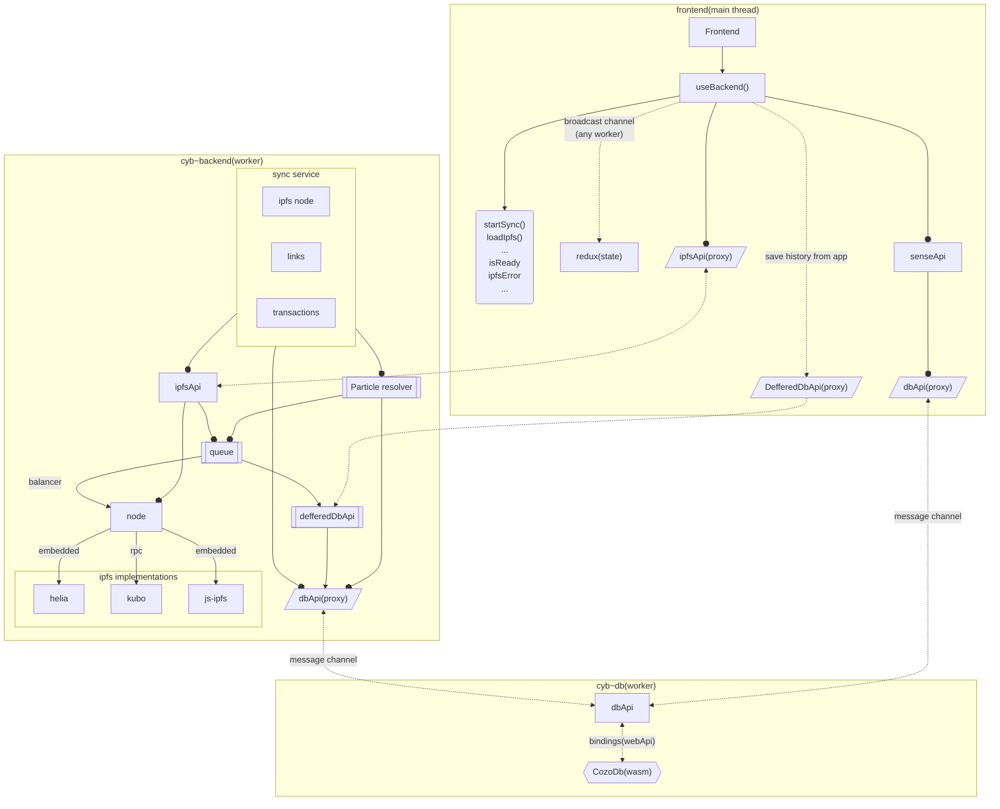

# Backend Architecture

```mermaid
graph TD;

    subgraph frontend["frontend(main thread)"]
        App["Frontend"]-->Hook["useBackend()"];
        Hook-->methods("startSync()\nloadIpfs()\n...\nisReady\nipfsError\n...");
        Hook-.broadcast channel\n(any worker).->reducer["redux(state)"]
        Hook-.save history from app.->defferedDbApiFront[/"DefferedDbApi(proxy)"/]
        Hook--osenseApi["senseApi"];
        Hook--oipfsApiFront[/"ipfsApi(proxy)"/];
        senseApi--odbApi[/"dbApi(proxy)"/];
    end

    dbApi<-.message channel.->dbWorker["dbApi"];
    subgraph dbWorkerGraph["cyb~db(worker)"]
        dbWorker<-.bindings(webApi).->cozodb{{"CozoDb(wasm)"}}
    end

    defferedDbApiFront-.->defferedDbApi;
    ipfsApiFront<-.->ipfsApi;
    subgraph backgroundWorker["cyb~backend(worker)"]
        subgraph sync["sync service"]
            ipfsNode["ipfs node"];
            links;
            transactions;
        end
        sync--oparticleResolver[["Particle resolver"]]
        particleResolver--oqueue;
        particleResolver--odbProxyWorker;
        sync--oipfsApi;
        sync--odbProxyWorker[/"dbApi(proxy)"/];
        defferedDbApi[["defferedDbApi"]]-->dbProxyWorker;
        queue-->defferedDbApi;
        ipfsApi--oqueue[["queue"]];
        ipfsApi--onode["node"];
        queue--balancer-->node;
        node--embedded-->helia;
        node--rpc-->kubo;
        node--embedded-->js-ipfs;
        subgraph ipfs["ipfs implementations"]
            helia;
            kubo;
            js-ipfs;
        end

        dbProxyWorker<-.message channel.->dbWorker
    end

```
