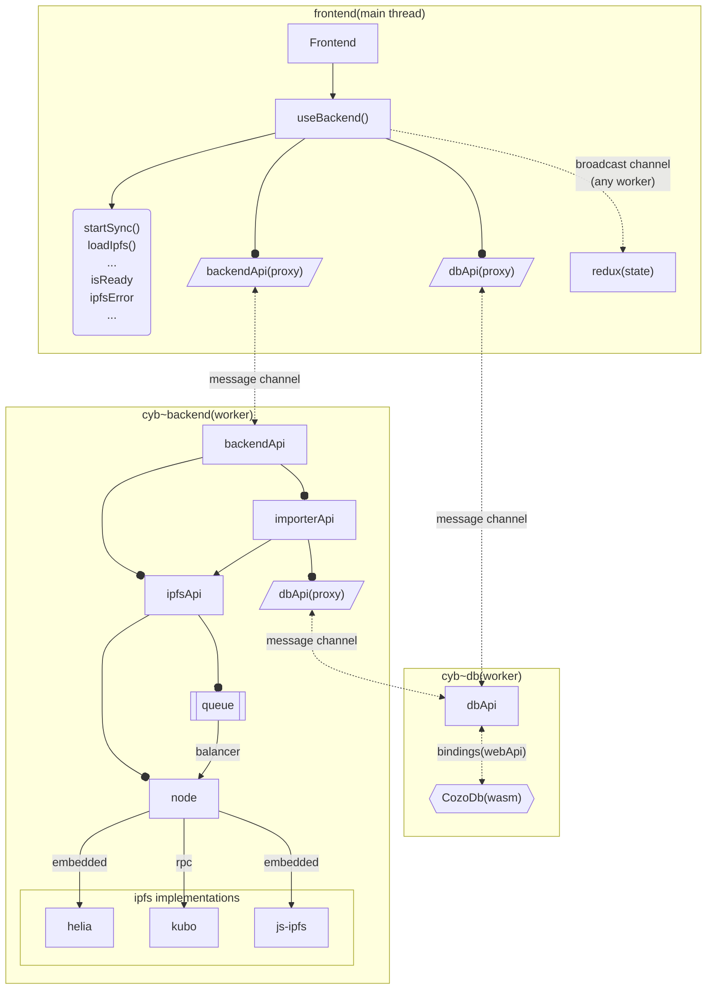

# Backend Architecture

```mermaid
graph TD;

    subgraph frontend["frontend(main thread)"]
        App["Frontend"]-->Hook["useBackend()"];
        Hook-->methods("startSync()\nloadIpfs()\n...\nisReady\nipfsError\n...");
        Hook--odbApi[/"dbApi(proxy)"/];
        Hook--obackendApiFront[/"backendApi(proxy)"/];
        Hook-.broadcast channel\n(any worker).->reducer["redux(state)"]
    end

    dbApi<-.message channel.->dbWorker["dbApi"];
    subgraph dbWorkerGraph["cyb~db(worker)"]
        dbWorker<-.bindings(webApi).->cozodb{{"CozoDb(wasm)"}}
    end

    backendApiFront<-.message channel.->backendApi;

    subgraph backgroundWorker["cyb~backend(worker)"]
        backendApi--oipfsApi;
        backendApi--oimporterApi;
        importerApi;
        ipfsApi;
        importerApi-->ipfsApi;
        ipfsApi--oqueue[["queue"]];
        ipfsApi--o node["node"];
        queue--balancer-->node;
        node--embedded-->helia;
        node--rpc-->kubo;
        node--embedded-->js-ipfs;
        subgraph ipfs["ipfs implementations"]
            helia;
            kubo;
            js-ipfs;
        end

        importerApi--odbProxyWorker[/"dbApi(proxy)"/];
        dbProxyWorker<-.message channel.->dbWorker
    end

```
