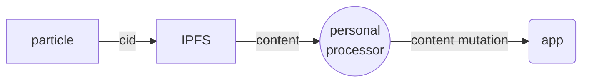
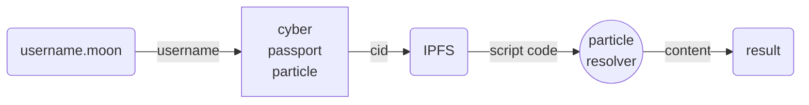
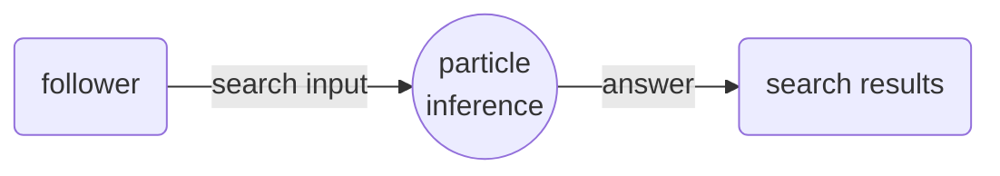

# Soul: Scripting Guide

[Rune Language]: https://rune-rs.github.io
[Cyber]: https://cyb.ai

[Cyber] uses [Rune Language] for embeddable scripting aka _cyber-scripting_.

Rune is virtual machine(WASM module written on Rust) that runs inside cyber.

Using cyber-scripting any cyber citizen can tune-up his "soul", and extend and modify cyber behaivior and functionality.

Currently cyber-script is stored in IPFS and CID of that is linked directly to user's passport.

## cyb module

cyb module provide bindings that connect cyber-scripting with app and extend [Rune language] functionality.

#### Distributed computing

Allows to evaluate code from external IPFS scripts in verifiable way, execute remote computations

```
// Evaluate sfunction from IPFS
cyb::eval_script_from_ipfs(cid,'func_name', #{'name': 'john-the-baptist', 'evangelist': true, 'age': 33})

// Evaluate remote function(not ready yet)
cyb::eval_remote_script(peer_id, func_name, params)
```

#### Passport

Get info about Citizenship

```
// Get passport data by nickname
cyb::get_passport_by_nickname(nickname: string) -> json;
```

#### Cyber links

Work with Knowelege Graph

```
cyb::get_cyberlinks_from_cid(cid: string) -> json;
cyb::get_cyberlinks_to_cid(cid: string)  -> json;

// Search links by text or cid
cyb::cyber_search(query: string) -> json;

// Create cyber link
// (this action will trigger signer)
cyb::cyber_link(from_cid: string, to_cid: string);
```

#### IPFS

Work with IPFS

```
cyb::get_text_from_ipfs(cid: string) -> string;
cyb::add_text_to_ipfs(text: string);
```

#### Experemental

OpenAI promts(beta)

```
// Apply prompt OpenAI and get result
cyb::open_ai_prompt(prompt: string; api_key: string) -> string;
```

#### Debug

Logging and debug methods

```
// Add debug info to script output
dbg(`personal_processor ${cid} ${content_type} ${content}`);

// console.log
cyb:log("blah");
```

## Entrypoints

Entrypoint is important concept of cyber scripting, literally that is the place where cyber-script is inlined into app pipeline.
At the moment each entrypoint type is related to some particle in cyber.

- Moon Domain Resolver
- Personal Processor
- Particle Inference

### Entrypoint principles

Each entrypoint is function that accept `params` argument as **input**.
`params` is dynamic key-value object with 0-n props.

```
pub async fn personal_processor(params) {
    let cid = params.cid;
    let content = params.content;
    // ... //
}
```

_`personal_processor` is entrypoint for each-single particle(see. furter)_

Second convention that each storypoint should return **output** object that with one required property named action and some optional props depending on action for ex. `#{action: 'pass'}`.
cyber-scripting has helpers to construct responses

```
pass() // pass untouched = #{action: 'pass'}

hide() // hide particle = #{ "action": "hide" }

cid_result(cid) // change particle's cid and parse = #{ "cid": cid, "action": "cid_result" }

content_result(content) //  modify particle content = #{ "content": content, "action": "content_result" }

error(message) // error ^_^ = #{ "message": message, "action": "error" }
```

So minimal entrypoint looks like this:

```
pub async fn personal_processor(params) {
    return pass()
}
```

### Entrypoint types

#### Particle post-processor

Every single particle in app goes thru pipeline and **personal_processor** function is applied to the this content:



```
// params:
//      cid: CID of the content
//      contentType: text, image, link, pdf, video, directory, html etc...
//      content: content itself (text only supported at the moment)
pub async fn personal_processor(params) {
    let cid = params.cid; // CID of the particle
    let content_type = params.contentType; // text, image, video, audio, pdf, etc...
    let content = params.content; //  content (text only supported for now)
}
```

User can do any transformation/mutation of content in pipeline, and return next result using helper functions

```
// Update content
return content_result("Transformed content")

// Replace CID -> reapply new item
return cid_result("Qm.....")

// Hide item from the UI
return hide()

// Keep it as is
return pass()
```

#### .moon domain resolver

Every user can write his own .moon domain resolver: _[username].moon_. When any other user meep particle with exactly such text, entrypoint will be executed.



Minimal resolver can looks like this:

```
pub async fn moon_domain_resolver(params) {
    // particle consumer from context
    let name = cyb::context.nickname;

    // Content
    return content_result(`Hello ${name}!`)
    // or CID
    // return cid_result("QmcqikiVZJLmum6QRDH7kmLSUuvoPvNiDnCKY4A5nuRw17")
}
```

_There is no params for this entrypoint, but context can be used as input(see furter)_

And there is minimal personal processor that process domain and run resolver from remote user script.

```
pub async fn personal_processor(params) {
    let content_type = params.contentType;
    let content = params.content;

    // check if text is passed here and it's looks like .moon domain
    if content_type == "text" and content.ends_with(".moon") {
            let items = content.split(".").collect::<Vec>();
            let username = items[0];
            let ext = items[1];
            if username.len() <= 14 && ext == "moon" {

                // get citizenship data by username
                let passport = cyb::get_passport_by_nickname(username).await;

                // get personal particle
                let particle_cid = passport["extension"]["particle"];

                // log to browser console
                cyb::log(`Resolve ${username} domain from passport particle '${particle_cid}'`);

                // execute user 'moon_domain_resolver' function from 'soul' script
                return cyb::eval_script_from_ipfs(particle_cid, "moon_domain_resolver", #{}).await;
        }
    }
}
```

#### ~~Particle Inference~~

###### _(in developement)_

Every user is able to create his own particle that appears in search results of all his followers and depends:



```
particle_inference(params) {
    let input = params.input // search input aka command
    pass()
}
```

### Context

One of important thing, that can be used inside scripting is the context.
Context point to place and obstacles where entrypoint was triggered. Context is stored in `cyb::context` and contains such values:

- params(url params)
  - path / query / search
- user(user that executes entrypoint)
  - address / nickname / passport
- secrets(key-value list from the cyber app)
  - key/value storage

```
// Get list of url parameters
let path = cyb::context.params.path;

// nick of user that see this particle(in case of domain resolver)
let name = cyb::context.user.nickname;

//get some secret
let openAI_apiKey = cyb::context.secrets.openAI_apiKey;

```

## Advanced examples

#### Personal processor

```
// empty params
pub async fn moon_domain_resolver(params) {
    dbg("moon_domain_resolver fired");
    // QmcqikiVZJLmum6QRDH7kmLSUuvoPvNiDnCKY4A5nuRw17 - is html app hosted in IPFS
    return cid_result("QmcqikiVZJLmum6QRDH7kmLSUuvoPvNiDnCKY4A5nuRw17")
}

// params:
//      cid: CID of the content
//      contentType: text, image, video, pdf, etc...
//      content: content itself(text only supported for now)
pub async fn personal_processor(params) {
    let cid = params.cid;
    let content_type = params.contentType;
    let content = params.content;
    dbg(`personal_processor ${cid} ${content_type} ${content}`);
    if content_type != "text" {
        return pass()
    }

    if content.ends_with(".moon") {
        let items = content.split(".").collect::<Vec>();
        let username = items[0];
        let ext = items[1];
        if username.len() <= 14 && ext == "moon" {
            let passport = cyb::get_passport_by_nickname(username).await;
            let particle_cid = passport["extension"]["particle"];
            cyb::log(`Resolve ${username} domain from passport particle '${particle_cid}'`);
            let result = cyb::eval_script_from_ipfs(particle_cid, "moon_domain_resolver", #{}).await;
            dbg(result);
            return result
        }
    }

    if content.contains("dasein") {
        cyb::log(`Update ${cid} content, replace 'Mark Zukerberg' to 'Elon Musk'`);
        return content_result(content.replace("Mark Zukerberg", "Elon Musk"))
    }

    if content.contains("хуярта") {
        cyb::log(`Hide ${cid} item because of 'хуярта' in the content`);
        return hide()
    }

    if content.contains("@NOW") {
        let left_part = content.split("@NOW").next().unwrap();
        let symbol = left_part.split(" ").rev().next().unwrap();

        // external url call
        let json =  http::get( `https://api.binance.com/api/v3/ticker?symbol=${symbol}`).await?.json().await?;
        return content_result(content.replace(`${symbol}@NOW`, json["lastPrice"]))
    }

    if content.contains("openai@me") {
        // get path from url
        let path = cyb::context.app.params.path;
        if path.len() >= 2 && path[0] == "ipfs" {

            // get openAI api key from secrets
            let openAI_api_key = cyb::context.app.secrets.openAI_api_key;

            // get current item CID fro url cyb.ap/ipfs/Qm.....
            let cid = path[1];

            // get current item content from IPFS
            let main_text = cyb::get_text_from_ipfs(cid).await;
            // apply openAI prompt
            let result = cyb::open_ai_prompt(`${main_text}\r\n What is this text about?`, openAI_api_key).await;
            return content_result(`OpenAI say: ${result}`);
        }
    }

    pass() // Pass as is
}
```
