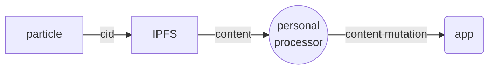
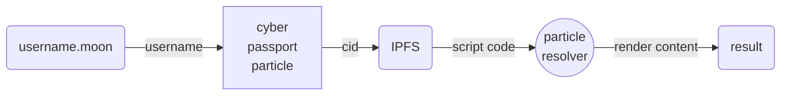
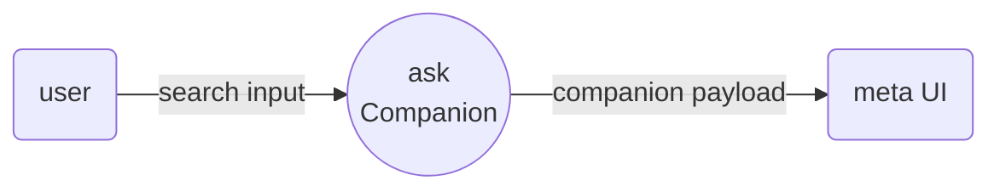

# soul: scripting guide

[rune Language]: https://rune-rs.github.io
[cyb]: https://cyb.ai

[cyb] uses [rune Language] for embeddable scripting aka [[cybscript]].

rune is virtual machine that runs inside cyb and process all commands and rendering results

## why we choose new language?

rune is dynamic, compact, portable, async and fast scripting language which is specially targeted to rust developers.

to our dismay we was not able to find any other way to provide dynamic execution in existing browsers which are compatable with future wasm based browsers.

rune is wasm module written in rust.

we hope you will enjoy it.

Using cybscript any cyber citizen can

- tune-up his [[soul]]
- extend and modify robot behaivior and functionality

soul is stored in [[ipfs]] and is linked directly to avatars passport.

## CYB module

cyb module provide bindings that connect cyber-scripting with app and extend [Rune language] functionality.

#### Distributed computing

Allows to evaluate code from external IPFS scripts in verifiable way, execute remote computations

```
// Evaluate function from IPFS
cyb::eval_script_from_ipfs(cid,'func_name', #{'name': 'john-the-baptist', 'evangelist': true, 'age': 33})

// Evaluate remote function(in developement)
cyb::eval_remote_script(peer_id, func_name, params)
```

#### Passport

Get info about Citizenship

```
// Get passport data by nickname
cyb::get_passport_by_nickname(nickname: string) -> json;
```

#### Cyber links

Work with Knowelege Graph

```
cyb::get_cyberlinks_from_cid(cid: string) -> json;
cyb::get_cyberlinks_to_cid(cid: string)  -> json;

// Search links by text or cid
cyb::cyber_search(query: string) -> json;

// Create cyber link
// (this action requires trigger signer)
cyb::cyber_link(from_cid: string, to_cid: string);
```

#### IPFS

Work with IPFS

```
cyb::get_text_from_ipfs(cid: string) -> string;
cyb::add_content_to_ipfs(text: string);
```

#### Local relational-graph-vector database

Access to [[cozo]] and your [[brain]] data represented in text and vector-based formats.

```
// return N closest particles based on embeddings of each
cyb::search_by_embedding(text:string, count: int) -> string[];
```

#### Experemental

OpenAI promts(beta)

- api key should be added using cyb-keys
- this is wrapper around [openai api](https://platform.openai.com/docs/api-reference/chat/create)

```
// Apply prompt OpenAI and get result
cyb::open_ai_completions(messages: object[]; apiKey: string;  params: json) -> string | AsyncIterable<string>;
```

#### Debug

Logging and debug methods

```
// Add debug info to script output
dbg(`personal_processor ${cid} ${content_type} ${content}`);

// console.log
cyb:log("blah");
```

## Entrypoints

Entrypoint is important concept of cyber scripting, literally that is the place where cyber-script is inlined into app pipeline.
At the moment all entrypoint types is related to some particle in cyber:

- Moon Domain Resolver
- Personal Processor
- Ask Companion

### Entrypoint principles

Each entrypoint is function that accept some arguments as **input**.

```
pub async fn personal_processor(cid, content_type, content) {
    // ... //
}
```

_`personal_processor` is entrypoint for each-single particle(see. furter)_

Second convention that each entrypoint should return **output** object - with one required property named _action_ and some optional props depending on action for ex. `#{action: 'pass'}`.

Cyber-scripting has helpers to construct object-like responses, with mandatory "action" field and some optional fields:

```
pass() // pass untouched = #{action: 'pass'}

hide() // hide particle = #{ "action": "hide" }

cid_result(cid) // change particle's cid and parse = #{ "action": "cid_result", "cid": cid  }

content_result(content) //  modify particle content = #{ "action": "content_result", "content": content }

error(message) // error ^_^ = #{ "action": "error", "message": message }
```

So minimal entrypoint looks like this:

```
pub async fn personal_processor(cid, content_type, content) {
    return pass() // keep data stream untouched
}
```

### Entrypoint types

#### Particle processor

Every single particle goes thru the pipeline and **personal_processor** function is applied to it content:



```
// params:
//      cid: CID of the content
//      content_type: text, image, link, pdf, video, directory, html etc...
//      content: (text only supported at the moment)
pub async fn personal_processor(cid, content_type, content) {
    /* SOME CODE */
}
```

User can do any transformation of the particle in pipeline

```
// Update content
return content_result("Transformed content")

// Replace CID -> re-apply new particle
return cid_result("Qm.....")

// Hide item from UI
return hide()

// Keep it as is
return pass()
```

#### .moon domain resolver

Every user can write his own .moon domain resolver: _[username].moon_. When any other user meep particle with exactly such text, entrypoint will be executed.



Minimal resolver can looks like this: \* _no input params but context is used(user that look at your domain)_

```
pub async fn moon_domain_resolver() {

    // particle consumer from context
    let name = cyb::context.nickname;

    // respond
    // as string
    return content_result(`Hello ${name}!`)

    // or CID(can be any text/image or even app hosted inside IPFS)
    // return cid_result("QmcqikiVZJLmum6QRDH7kmLSUuvoPvNiDnCKY4A5nuRw17")
}
```

And there is minimal personal processor that process domain and run resolver from remote user script.

```
pub async fn personal_processor(cid, content_type, content) {
    // check if text is passed here and it's looks like .moon domain
    if content_type == "text" and content.ends_with(".moon") {
            let items = content.split(".").collect::<Vec>();
            let username = items[0];
            let ext = items[1];
            if username.len() <= 14 && ext == "moon" {

                // get citizenship data by username
                let passport = cyb::get_passport_by_nickname(username).await;

                // get personal particle
                let particle_cid = passport["extension"]["particle"];

                // log to browser console
                cyb::log(`Resolve ${username} domain from passport particle '${particle_cid}'`);

                // execute user 'moon_domain_resolver' function from 'soul' script with zero params
                return cyb::eval_script_from_ipfs(particle_cid, "moon_domain_resolver", []).await;
        }
    }
}
```

#### Ask Companion

User can extend UI of the particle with custom controls. User can pass meta items as script result and cyb will render as UI extension.
At the moment we have 2 meta UI items:

- text: `meta_text("title")`
- link: `meta_link("/@master", "link to user named @master")`



```
pub async fn ask_companion(cid, content_type, content) {
    // plain text item
    let links = [meta_text("similar:")];

    // search closest 5 particles using local data from the brain(embedding-search)
    let similar_results = cyb::search_by_embedding(content, 5).await;


    for v in similar_results {
        // link item
        links.push(meta_link(`/oracle/ask/${v.cid}`, v.text));
    }

    return content_result(links)
}
```

### Context

One of important thing, that can be used inside scripting is the context.
Context point to place and obstacles where entrypoint was triggered. Context is stored in `cyb::context` and contains such values:

- params(url params)
  - path / query / search
- user(user that executes entrypoint)
  - address / nickname / passport
- secrets(key-value list from the cyber app)
  - key/value storage

```

// nick of user that see this particle(in case of domain resolver)
let name = cyb::context.user.nickname;

// user particle that contains soul, that can be interracted directly from your soul
let particle = cyb::context.particle;

// Get list of url parameters (in progress)
let path = cyb::context.params.path;

//get some secret (in progress)
let open_ai_api_key = cyb::context.secrets.open_ai_api_key;

```

## Advanced examples

#### Personal processor

```
// your content for <citizen_name>.moon domain
pub async fn moon_domain_resolver() {
    // get nickname of domain resolver at the momemnt
    let nickname =  cyb::context.user.nickname;

    let rng = rand::WyRand::new();
    let rand_int = rng.int_range(0, 999999);

    return content_result(`Hello, ${nickname}, your lucky number is ${rand_int} 🎉`);

    // substitute with some CID (ipfs hosted app in this case)
    // return cid_result("QmcqikiVZJLmum6QRDH7kmLSUuvoPvNiDnCKY4A5nuRw17")
}

// Extend particle page with custom UI elements
pub async fn ask_companion(cid, content_type, content) {
    // plain text item
    let links = [meta_text("similar:")];

    // search closest 5 particles using local data from the brain
    let similar_results = cyb::search_by_embedding(content, 5).await;


    for v in similar_results {
        // link item
        links.push(meta_link(`/oracle/ask/${v.cid}`, v.text));
    }

    return content_result(links)
}

// Transform content of the particle
pub async fn personal_processor(cid, content_type, content) {

    // skip any non-text content
    if content_type != "text" {
        return pass()
    }

    // <citizen_name>.moon domain resolver
    if content.ends_with(".moon") {
        let items = content.split(".").collect::<Vec>();

        let username = items[0];
        let ext = items[1];

        if username.len() <= 14 && ext == "moon" {

            // get passport data by username
            let passport = cyb::get_passport_by_nickname(username).await;

            // particle - CID of soul script
            let particle_cid = passport["extension"]["particle"];

            cyb::log(`Resolve ${username} domain from passport particle '${particle_cid}'`);

            // resolve content(script) by cid
            // evaluate 'moon_domain_resolver' from that
            let result = cyb::eval_script_from_ipfs(particle_cid, "moon_domain_resolver", []).await;

            return result
        }
    }

    // example of content exclusion from the search results
    let buzz_word = "пиздопроебанное хуеплетство";

    if content.contains(buzz_word) {
        cyb::log(`Hide ${cid} item because of '${buzz_word}' in the content`);
        return hide()
    }


    // example of content modification
    // replaces cyber with cyber❤
    let highlight_text = "cyber";
    let highlight_with = "❤";

    if content.contains(highlight_text) {
        cyb::log(`Update ${cid} content, highlight ${highlight_text}${highlight_with}`);
        return content_result(content.replace(highlight_text, `${highlight_text}${highlight_with}`))
    }

    // replace <token_name>@NOW (ex. bitcoin@NOW) with actual price in usdt
    // using external api call
    if content.contains("@NOW") {
        let left_part = content.split("@NOW").next().unwrap();
        let token_name = left_part.split(" ").rev().next().unwrap();
        let vs_currency = "usd";

        // external url call
        let json =  http::get(`https://api.coingecko.com/api/v3/simple/price?ids=${token_name}&vs_currencies=${vs_currency}`).await?.json().await?;
        return content_result(content.replace(`${token_name}@NOW`, `Current ${token_name} price is ${json[token_name][vs_currency]} ${vs_currency}`))
    }

    // anything else - pass as is
    pass()
}
```
