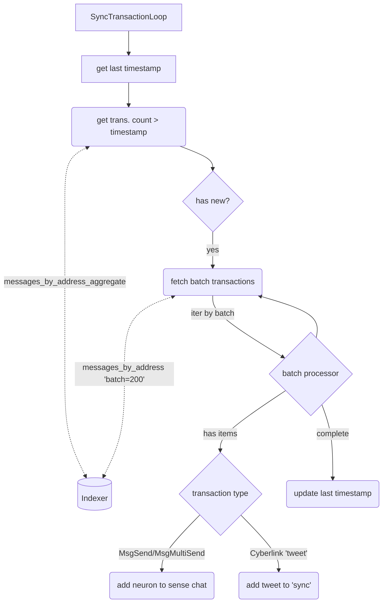
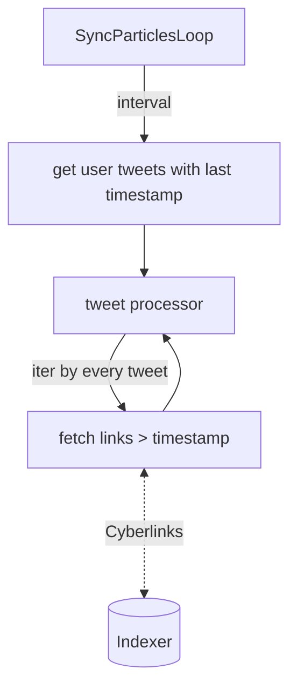
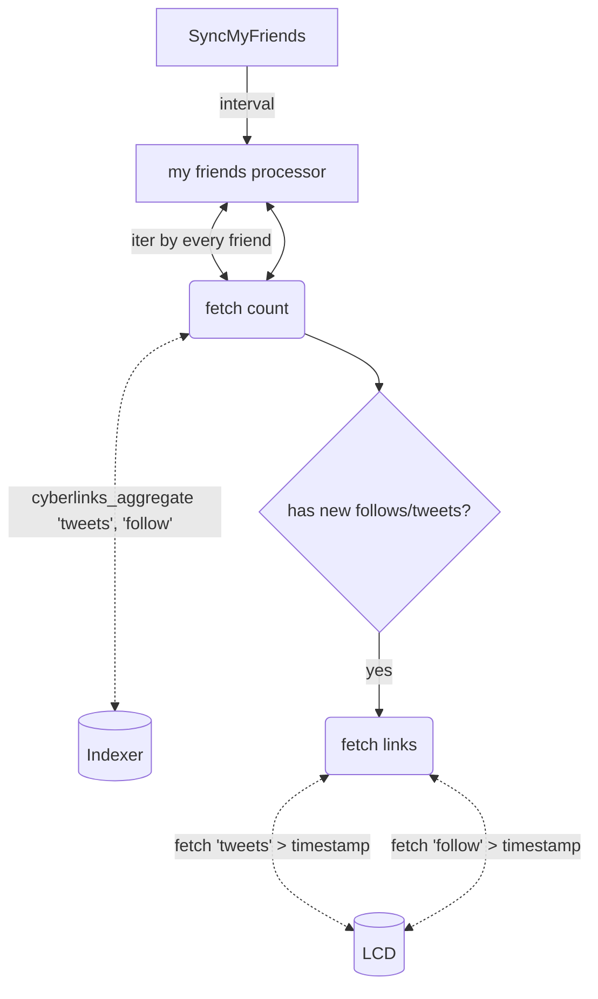

##General

- every process is RxJs async loop with N-second interval
- all CID from's from any links in any process goes to separate _particle resolver queue(non-blocking)_

##My transactions

Process current neuron transactions: extract tweets, and chat(any interractions with other neurons).
_Transactions can be heavy, for ex. there can be MultiSend/broadcast transactions of 150-200Kb_

> **request count** = 1 aggregate req. + [user_transactions_count/batch].
> example - 1000 trans., batch is 200, requests = 1 + 1000/200 = 6
> every 60 sec.

- save all transactions to DB
- create sense chat for all unique neuron with in/out MsgSend/MsgMultisend
- extract 'tweet' links and add it to sync items(SyncParticlesLoop)

##My particles(tweets)
Process current user tweets

> **request count** = user_links_from='tweet' \* [links_count/batch]
> example - 100 tweets. requests = \* [???/10] = [100...???]
> every 60 sec.

##My friends
Process current user friend tweets+follows

> **request count** = following*users * (1(indexer) + [2(lcd)])
> example - following is 10, requests = 10 \* (1 + [2]) = [10...30]
> every 60 sec.

